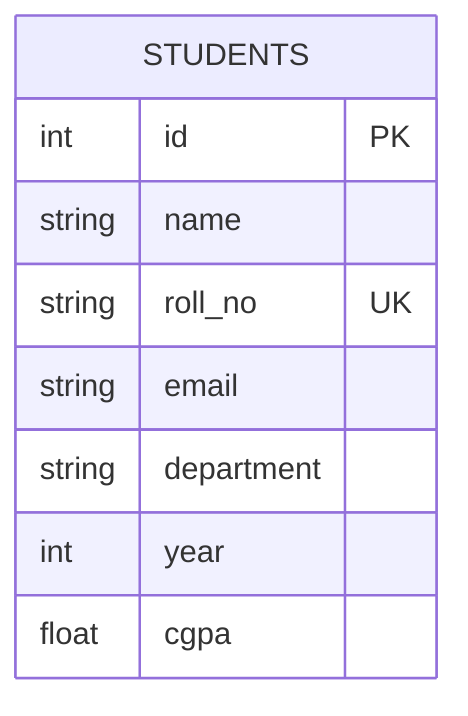

# Student Management System — CRUD Web Application

**Activity:** VSB Skill Vault — Activity 3 (Mini Web Application)
**Student:** Akshara KR.

## 1. Overview
A full-stack CRUD web application to manage student records (add, view, edit, delete, search).

## 2. Problem Statement
Colleges need a simple system to maintain student records — name, roll number, email, department, year, and CGPA — with the ability to create, view, update, and delete entries.

## 3. Objectives
- Implement full CRUD functionality end-to-end
- Provide a responsive, validated user interface
- Expose a REST API consumed by the frontend

## 4. Technology Stack
| Layer | Technology |
|---|---|
| Frontend | HTML, CSS, JavaScript (Fetch API) |
| Backend | Python, Flask |
| Database | SQLite |
| API Testing | Postman / curl |
| Version Control | Git |

## 5. Architecture
```
Browser (HTML/CSS/JS) → Fetch API → Flask REST API → SQLite Database
```

## 6. Database Design
**Table: students**
| Field | Type | Constraint |
|---|---|---|
| id | INTEGER | PRIMARY KEY, AUTOINCREMENT |
| name | TEXT | NOT NULL |
| roll_no | TEXT | NOT NULL, UNIQUE |
| email | TEXT | NOT NULL |
| department | TEXT | NOT NULL |
| year | INTEGER | NOT NULL |
| cgpa | REAL | |
### ER Diagram



## 7. REST API Endpoints
## 7. REST API Endpoints
| Operation | Method | Endpoint | Result |
|---|---|---|---|
| Create | POST | /api/students | New record created |
| Read All | GET | /api/students | List of records (supports `?search=`) |
| Read One | GET | /api/students/{id} | Single record |
| Update | PUT | /api/students/{id} | Record updated |
| Delete | DELETE | /api/students/{id} | Record removed |

## 8. Validation
- Required fields: name, roll_no, email, department, year
- Email format checked via regex
- Year must be 1–5, CGPA must be 0–10
- Roll number uniqueness enforced at the database level (returns a clear error on duplicate)
- All validation is server-side (source of truth), so it can't be bypassed by disabling JS

## 9. Installation & Execution
```bash
pip install -r requirements.txt
python app.py
```
Then open **http://127.0.0.1:5000** in a browser. The SQLite database (`students.db`) is created automatically on first run.

## 10. Testing Performed
Verified via automated test client covering:
- Create with valid data → 201
- Read all / read one → 200
- Update → 200
- Create with missing/invalid fields → 400 with field-level errors
- Create with duplicate roll number → 400
- Delete → 200, confirmed record removed from subsequent read

## 11. Challenges & Solutions
- **Challenge:** Preventing duplicate roll numbers.
  **Solution:** UNIQUE constraint at the DB layer plus a caught `IntegrityError` returned as a clean API error.
- **Challenge:** Keeping client and server validation consistent.
  **Solution:** Server-side validation is authoritative; the UI just mirrors the same rules for faster feedback.

## 12. Future Enhancements
- Authentication (admin login)
- Pagination for large record sets
- Export to CSV/Excel
- Switch to MySQL/PostgreSQL for production deployment

## 13. Project Structure
```
student-crud/
├── app.py                # Flask backend + REST API
├── requirements.txt
├── students.db           # created at runtime
├── templates/
│   └── index.html
└── static/
    ├── css/style.css
    └── js/app.js
```
